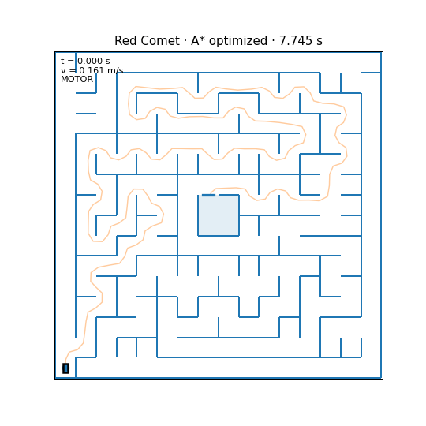
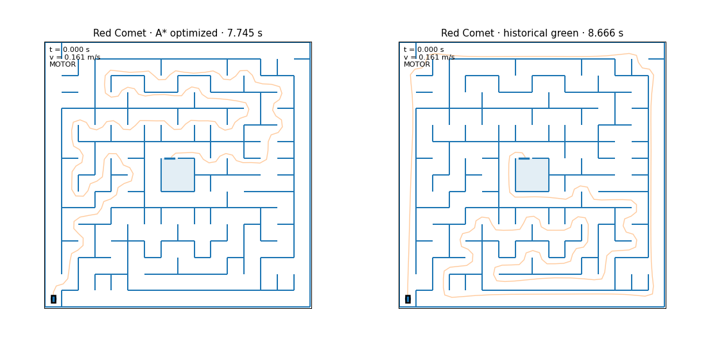
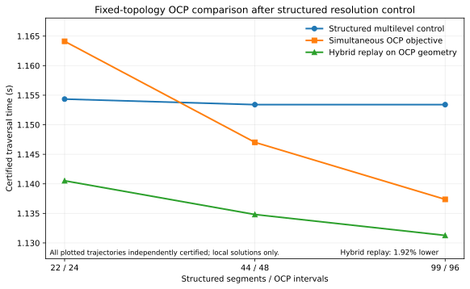

# Time-Optimal Micromouse Planner

A physics-aware Micromouse planner that searches maze topologies, constructs continuous-curvature trajectories, and optimizes traversal time under profile-selected vehicle dynamics.

<p align="center">
  
</p>

The project combines discrete maze search with continuous optimal-control machinery: clothoid geometry, speed-profile optimization, native C/C++ kernels, selective active-basis refinement, and independent feasibility/physics certification.

## Red Comet 2017 case study

Red Comet was a championship Micromouse robot whose 2017 winning run became known for taking a deliberately longer route to preserve speed through the maze. That result was one of the original motivations for this project. I used the historical maze as a held-out case study under the frozen `red_comet_2017_dd_yaw_v1` model:

| Topology                   | Grid steps | Optimized time |
| -------------------------- | ---------: | -------------: |
| **Shortest/A***            |     **99** | **7.744675 s** |
| Historical Red Comet route |        121 |     8.666065 s |
| Best other simple topology |        103 |     8.176914 s |

<p align="center">
  
</p>

Under this model, the result **reverses the motivating narrative**: the continuously optimized shortest-distance A* topology finishes **0.921 s (11.9%) faster** than the corrected historical route. Exhaustive search evaluated all **10 simple start-to-goal junction topologies** admitted by the no-revisit policy; none beat A*.

This does not imply that Red Comet's real-world 2017 strategy was wrong: the historical robot had sensing, control, suction, load-transfer, and race-day effects that are not fully represented by the calibrated model. The result instead illustrates how strongly the time-optimal topology depends on the physical assumptions.

The reported trajectory is a certified best solution found by the continuous optimizer on the winning topology, not a proof of the global continuous optimum. See [`docs/RED_COMET_CASE_STUDY.md`](docs/RED_COMET_CASE_STUDY.md) for the full calibration, transcription, search, certification, and provenance.

## System

<p align="center">
  
</p>

The detailed end-to-end design is in [`docs/ARCHITECTURE.md`](docs/ARCHITECTURE.md).

At a high level:

1. Parse or generate a maze and build its junction graph.
2. Search candidate cell/junction topologies with A* and branch-and-bound.
3. Convert a topology into a continuous G2/clothoid trajectory problem.
4. Optimize curvature/geometry and traversal time under corridor constraints.
5. In the qualified `active_basis_v11` workflow, refine only dynamically supported turn structure.
6. Certify geometry and independently evaluate the final dynamic time model.

The generic CLI currently defaults to `integrated_v10`; the final Red Comet case study uses the explicit qualified `active_basis_v11` architecture. The hot path uses native components under `native/` for flow evaluation, segment dynamics, crossings, reverse solves, and profile-specific vehicle dynamics. The legacy benchmark model uses the qualified MOTOR/GRIP/BRAKE stack; the Red Comet case study selects the separate differential-drive/yaw backend. Python remains the orchestration and reference/certification layer.

## Independent simultaneous-OCP cross-check

A separate CasADi/IPOPT benchmark solves one fixed topology as a simultaneous optimal-control NLP over geometry and squared speed. Because the original structured control used only 11 clothoid segments, the final fairness pass **exactly prolonged and re-optimized** the structured trajectory through 22, 44, and 99 segments while always retaining the previous certified trajectory as an incumbent.

| Matched resolution | Structured multilevel control | OCP objective | Hybrid replay on OCP geometry |
|---|---:|---:|---:|
| 22 segments / 24 intervals | **1.154340 s** | 1.164119 s | **1.140520 s** |
| 44 segments / 48 intervals | 1.153401 s | **1.147024 s** | **1.134812 s** |
| 99 segments / 96 intervals | 1.153401 s | **1.137373 s** | **1.131274 s** |

<p align="center">
  
</p>

The structured solution improves from **1.171355 s** at 11 segments to **1.153401 s** after multilevel refinement, and the final 44→99 resegmentation changes the certified time by only about `1e-10 s` after the first local transaction. The 96-interval OCP objective is still **1.39% lower**, while evaluating the OCP-discovered geometry with the production continuous hybrid speed solver gives **1.131274 s**, **1.92% lower** than the refined structured result.

The multilevel control is the canonical Benchmark 8 comparison. It supports a **local-basin/formulation** explanation for the remaining gap rather than insufficient clothoid resolution; neither formulation is claimed globally optimal. The compact control data is in `benchmark_results/reference/full_ocp_resolution_control.json`. See [`docs/OCP_COMPARISON.md`](docs/OCP_COMPARISON.md) for the full formulation and fairness-control discussion.

## Quick start

Linux or WSL with a C/C++ toolchain and Python 3.13+ is the intended environment.

```bash
python -m venv .venv
source .venv/bin/activate
python -m pip install --upgrade pip
python -m pip install -r requirements-benchmarks.txt
make native
make test
```

Inspect planner options with:

```bash
python main.py --help
```

The benchmark infrastructure has a fast public smoke profile:

```bash
make benchmark-smoke
```

Reference benchmark outputs are checked into `benchmark_results/reference/`; ordinary reruns are ignored by git.

## Reproducing the publication visuals

The public Red Comet figures are postprocessing-only and use the compact checked-in final snapshot:

```bash
python -m tools.visuals.red_comet_release
```

This regenerates the run-derived assets under `assets/red_comet/` without rerunning the multi-hour topology/continuous-optimization campaign, including the synchronized A*/historical comparison GIF. The architecture diagram is maintained separately from `tools/visuals/planner_architecture_tikz.tex` and is intentionally not touched by this command.

The OCP comparison graphic is generated only from the compact checked-in resolution-control JSON:

```bash
python -m tools.visuals.ocp_comparison
```

## Documentation

The root README is intentionally an overview. The technical details are split into focused documents:

| Document | Contents |
|---|---|
| [`docs/ARCHITECTURE.md`](docs/ARCHITECTURE.md) | end-to-end discrete/continuous/native/certification architecture |
| [`docs/SPEED_PROFILE_SOLVER.md`](docs/SPEED_PROFILE_SOLVER.md) | hybrid forward/backward speed solver, events, gradients, MVC anchors, DD/yaw |
| [`docs/GEOMETRY_OPTIMIZATION.md`](docs/GEOMETRY_OPTIMIZATION.md) | clothoids, corridor constraints, warm starts, solver backends, active basis |
| [`docs/PROJECT_HISTORY.md`](docs/PROJECT_HISTORY.md) | RK2 → Chebyshev → Taylor → Cflow → native/B&B/Red Comet research history |
| [`docs/RED_COMET_CASE_STUDY.md`](docs/RED_COMET_CASE_STUDY.md) | calibration, exhaustive search, final historical comparison and limitations |
| [`docs/OCP_COMPARISON.md`](docs/OCP_COMPARISON.md) | simultaneous CasADi/IPOPT comparison and multilevel resolution control |
| [`BENCHMARKS.md`](BENCHMARKS.md) | benchmark results and interpretation |
| [`benchmarks/README.md`](benchmarks/README.md) | benchmark harness/reproduction guide |
| [`examples/mazes/FORMAT.md`](examples/mazes/FORMAT.md) | custom maze file specification |
| [`visualization/README.md`](visualization/README.md) | release rendering and visualization API |

Native implementation details are documented beside the code under `native/*/README.md`. Generated evidence such as `benchmark_results/reference/BENCHMARK_REPORT.md` is intentionally kept machine-derived rather than rewritten as narrative prose.

## Repository layout

```text
analysis/red_comet_2017/   compact final case-study metadata and route snapshot
assets/red_comet/          publication-ready Red Comet figures and animation
assets/benchmarks/          publication-ready benchmark comparison figures
benchmarks/                reproducible evaluation/qualification framework
benchmark_results/reference/ checked-in benchmark evidence
docs/                      architecture, solver, history, OCP, and case-study chapters
planning/                  maze graph, topology search, bounds, route policies
optimization/              geometry, SQP, reverse solver, speed/time model
segment/                   segment and vehicle dynamics
native/                    C/C++ production kernels
visualization/             reusable plotting/animation primitives
tests/                     public regression tests
tools/                     research/optimization orchestration utilities
```

## Notes on the release snapshot

The repository intentionally excludes raw multi-hour optimizer workspaces, intermediate continuation checkpoints, compiled libraries/objects, and internal campaign logs. The compact Red Comet result retains the final trajectories, visual speed traces, search summary, model signature, and certification metadata needed to reproduce the public artifacts and support the reported comparison.

For benchmark methodology and the checked-in reference campaign, see [`BENCHMARKS.md`](BENCHMARKS.md).
