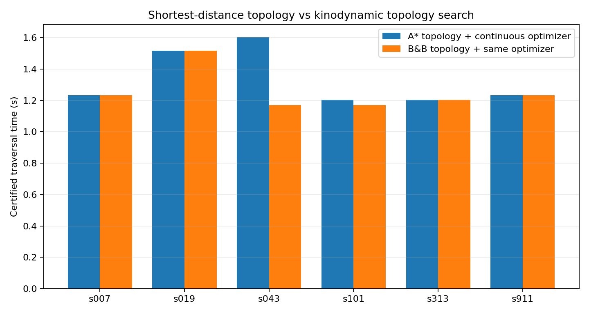
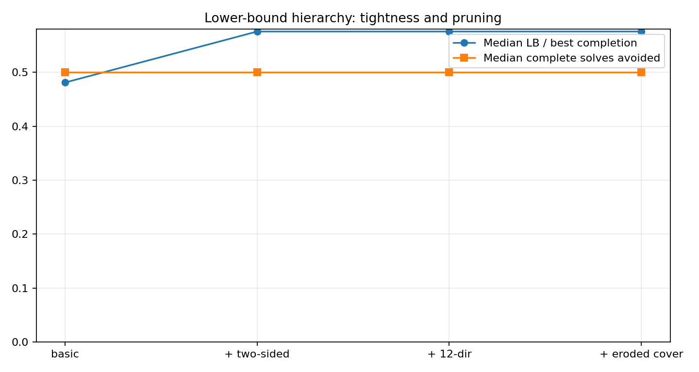
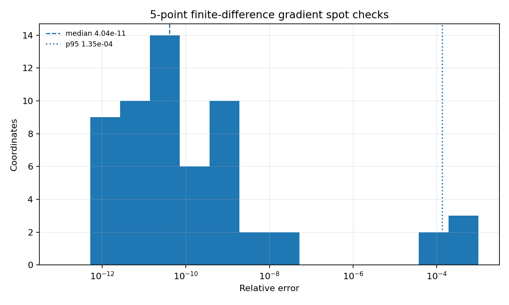
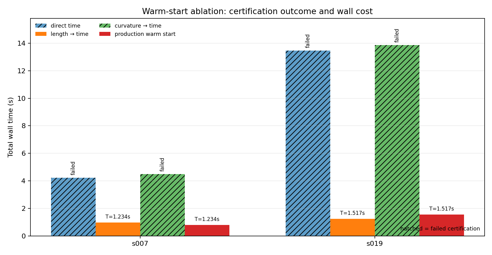
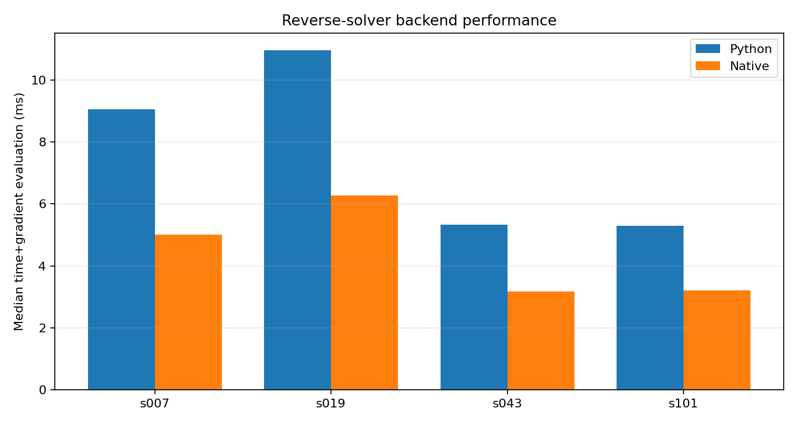
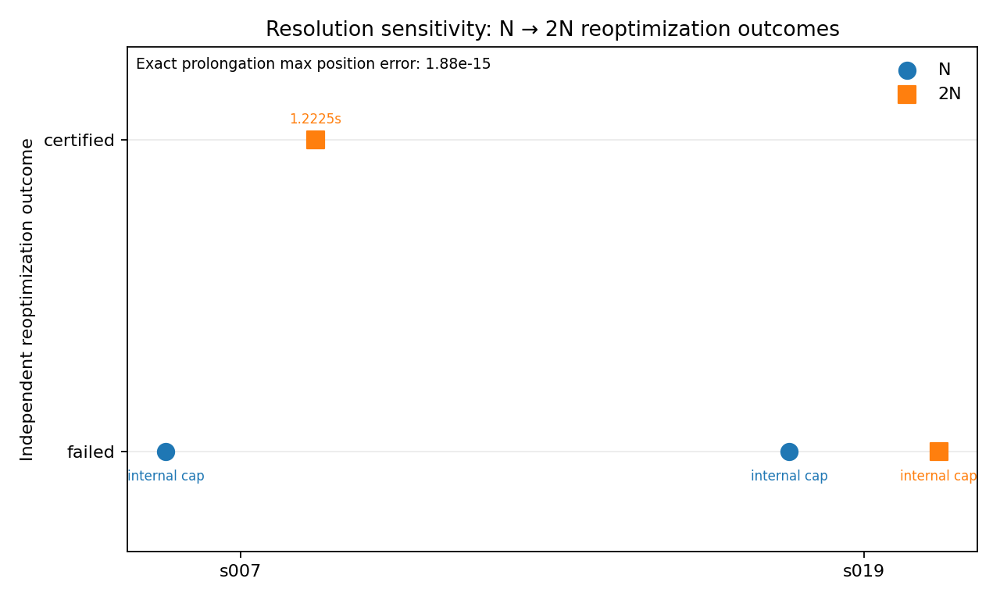
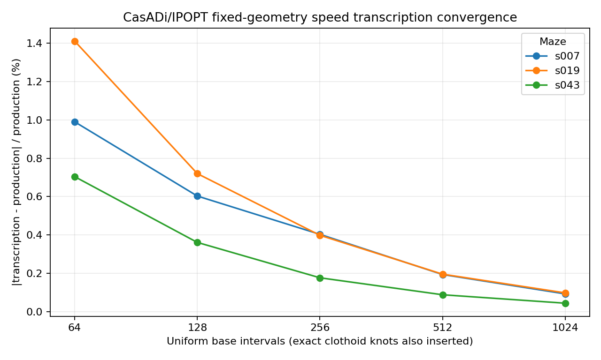

# AME Robot Benchmark Report

This report is generated exclusively from the machine-readable JSON files in this result directory. Numerical table entries and resume claims are derived from those files rather than manually copied into Markdown.

## Executive results

| Evidence | Measured result |
|---|---|
| Benchmark 1 — Shortest-distance A* topology vs kinodynamic topology search | 6/6 certified paired cases; median improvement 0.00%, max 27.09%; 2 topology changes |
| Benchmark 2 — Lower-bound admissibility, tightness, and pruning | B&B matched exhaustive enumeration on 3/3 mazes; 33 prefixes checked with 0 admissibility violations; median complete-route solves avoided 50.0% |
| Benchmark 3 — Speed-profile gradient correctness | Python/native max absolute gradient difference 0.0000; 5-point FD checked 58/66 coordinates with median relative error 4.035e-11 |
| Benchmark 4 — Geometry optimizer and warm-start ablation | 2 routes × 4 variants; production-vs-direct median final-time improvement n/a; median direct/production wall ratio n/a× |
| Benchmark 5 — Native C/C++ stack performance and equivalence | median time+gradient speedup 1.71×; representative optimization speedup 1.18×; max time-value error 0.0000 s |
| Benchmark 6 — Parameterization/resolution sensitivity | 0/2 certified N/2N pairs; median |relative time difference| n/a; max n/a |
| Benchmark 7 — Fixed-geometry direct-transcription baseline | finest 1024-interval cold transcription certified on 3/3 routes; median |time difference| 0.092%; median IPOPT/production solve-time ratio 934.9× |
| Benchmark 8 — Simultaneous fixed-topology OCP baseline | 3/3 OCP meshes independently certified; after multilevel structured reoptimization, finest 96-interval OCP objective 1.137373 s is -1.390% vs the 99-segment structured control; production hybrid replay on the OCP geometry is -1.918% vs structured |

## Reproducibility

- Source: source-tree SHA-256 `19c2fbf7a37b4912bf5d2f9bc40b7e109bfa80e89bc7b9e003077853ed8309d6`
- Imported production archive SHA-256: `b284fb1d3bb219b183aca9b3bda8f2de8cb6ed2072b188c93dd01137d250c496`
- Timestamp (UTC): `2026-09-03T22:59:15.728305+00:00`
- OS / architecture: `Linux 6.18.35 / x86_64`
- CPU: `AMD EPYC 9V74 80-Core Processor` (5 logical CPUs)
- Python: `CPython 3.13.5`
- NumPy / SciPy: `2.3.5` / `1.17.0`
- C / C++ compiler: `cc (Debian 14.2.0-19) 14.2.0` / `c++ (Debian 14.2.0-19) 14.2.0`
- Native benchmark artifacts present: `True`
- Thread environment: `{}`
- CasADi / IPOPT: `3.7.2` / `not_probed`
- Production dependencies: `python -m pip install -r requirements.txt`
- Core benchmark/test dependencies: `python -m pip install -r requirements-benchmarks.txt`
- OCP baseline dependencies: `python -m pip install -r requirements-benchmarks-ocp.txt`
- Exact checked-reference Python stack: `python -m pip install -r requirements-reference.txt`
- Native build: `make native`
- Fast infrastructure tests: `make benchmark-tests`
- Normal core campaign: `python -m benchmarks.run --profile core`
- Full campaign: `python -m benchmarks.run --profile all`
- Explicit checked-reference regeneration: `python -m benchmarks.run --profile all --reference --overwrite`

The generic OCP benchmarks run each numerical component in an isolated process group. A worker result is accepted only after its result file and completion marker are durable; teardown-only stalls are terminated after a short grace period so one solver's extension/plugin lifecycle cannot contaminate later timings.

## Benchmark 1 — Shortest-distance A* topology vs kinodynamic topology search

**Question.** Does discrete kinodynamic topology selection improve certified traversal time relative to optimizing the shortest-distance A* topology with the same continuous route optimizer?

The A* route is continuously optimized and independently certified before comparison. B&B uses the same complete-route optimization policy. No unoptimized centerline is compared against an optimized trajectory.

| case | cells/junctions | A* T (s) | B&B T (s) | improvement | topology changed | complete optimizations | expanded/generated | certified |
|---|---:|---:|---:|---:|---|---:|---:|---|
| cyclic_4x4_s007 | 16/15 | 1.233678 | 1.233678 | 0.00% | False | 2 | 11/12 | True |
| cyclic_4x4_s019 | 16/16 | 1.517307 | 1.517307 | 0.00% | False | 2 | 18/18 | True |
| cyclic_4x4_s043 | 16/14 | 1.604433 | 1.169761 | 27.09% | True | 2 | 10/11 | True |
| cyclic_4x4_s101 | 16/12 | 1.204203 | 1.169761 | 2.86% | True | 3 | 9/10 | True |
| cyclic_4x4_s313 | 16/14 | 1.204203 | 1.204203 | 0.00% | False | 2 | 17/20 | True |
| cyclic_4x4_s911 | 16/13 | 1.233678 | 1.233678 | 0.00% | False | 2 | 15/18 | True |

Across the certified predetermined suite, mean/median/max traversal-time improvement is **4.99% / 0.00% / 27.09%**, with **2** topology changes and **0** geometrically-longer-but-faster selections.

**Limitation.** B&B is exhaustive/global only over its finite discrete topology policy; the continuous NLP remains local.

## Benchmark 2 — Lower-bound admissibility, tightness, and pruning

Every allowed simple path in each tractable case is optimized and independently certified. Prefix lower bounds are checked against the best known certified completion under that finite topology set; a positive residual above tolerance fails the suite.

| case | simple paths | exhaustive best (s) | B&B best (s) | match | B&B complete solves | solves avoided | prefixes | max LB residual |
|---|---:|---:|---:|---|---:|---:|---:|---:|
| exhaustive_3x3_s007 | 4 | 0.65050199 | 0.65050199 | True | 2 | 50.0% | 15 | -0.2653 |
| exhaustive_3x3_s019 | 3 | 0.65050199 | 0.65050199 | True | 2 | 33.3% | 9 | -0.2653 |
| exhaustive_3x3_s043 | 3 | 0.66887453 | 0.66887453 | True | 1 | 66.7% | 9 | -0.2672 |

**Limitation.** This is a finite empirical admissibility check, not a substitute for the mathematical admissibility argument.

## Benchmark 3 — Speed-profile gradient correctness

Python/native reverse implementations agree to **0.0000 s** maximum travel-time difference and **0.0000** maximum absolute gradient difference. Five-point finite differences checked **58/66** attempted coordinates; excluded coordinates are reported rather than counted as passes.

Finite-difference relative error median / p95 / max: **4.035e-11 / 1.352e-04 / 9.428e-04**.

## Benchmark 4 — Geometry optimizer and warm-start ablation

The ablation holds the final time-optimization budget and certification policy fixed while changing how the initial geometry is prepared. Direct-time wins are retained when they occur.

| route | variant | certified | final T (s) | total wall (s) | major iterations | objective calls | selected stage |
|---|---|---|---:|---:|---:|---:|---|
| cyclic_4x4_s007 | direct_time | False | n/a | 4.229 | None | None | None |
| cyclic_4x4_s007 | length_then_time | True | 1.2336780 | 0.978 | 20 | 22 | full_time_optimization |
| cyclic_4x4_s007 | curvature_then_time | False | n/a | 4.501 | None | None | None |
| cyclic_4x4_s007 | production_warm_start | True | 1.2336780 | 0.811 | 20 | 22 | full_time_optimization |
| cyclic_4x4_s019 | direct_time | False | n/a | 13.461 | None | None | None |
| cyclic_4x4_s019 | length_then_time | True | 1.5173073 | 1.239 | 20 | 77 | time_projection |
| cyclic_4x4_s019 | curvature_then_time | False | n/a | 13.861 | None | None | None |
| cyclic_4x4_s019 | production_warm_start | True | 1.5173073 | 1.554 | 20 | 77 | time_projection |

## Benchmark 5 — Native C/C++ stack performance and equivalence

Median scalar speedup is **2.18×** and median time+gradient speedup is **1.71×**. The complete optimizer A/B rows are accepted only when both backends independently certify; their median measured end-to-end speedup is **1.18×**.

## Benchmark 6 — Parameterization/resolution sensitivity

Exact N→2N prolongation has maximum initial position error **1.884e-15**. **0/2** fixed-station pairs remained certified after both optimizations; only those pairs enter time-sensitivity aggregates.

| route | N segments | N outcome | N T (s) | 2N segments | 2N outcome | 2N T (s) | exact prolongation max position error |
|---|---:|---|---:|---:|---|---:|---:|
| cyclic_4x4_s007 | 11 | internal cap | n/a | 22 | certified | 1.2224987 | 9.930e-16 |
| cyclic_4x4_s019 | 14 | internal cap | n/a | 28 | internal cap | n/a | 1.884e-15 |

## Benchmark 7 — Fixed-geometry direct-transcription baseline

The fixed certified clothoid geometry is held constant. CasADi/IPOPT optimizes a dense piecewise-linear squared-speed profile under discretized versions of the production motor, brake, speed, friction-circle, and endpoint constraints. A separate continuous interval certificate—not IPOPT termination—decides feasibility.

At the finest predeclared **1024**-interval mesh, **3/3** cold-start routes certify. Median/max absolute relative time difference is **0.0924% / 0.0975%**. Median IPOPT/production scalar solve-time ratio is **934.9×**.

At the predeclared matched-initialization mesh, cold and production-sampled initializations differ in final NLP objective by at most **4.441e-16 s** across **3** matched pairs.

**Limitation.** This is one explicit dense direct-transcription formulation, not a universal comparison against optimal-control software.

## Benchmark 8 — Simultaneous fixed-topology OCP baseline

One predeclared topology is fixed, but geometry, phase lengths, curvature, and longitudinal dynamics are optimized simultaneously by a generic CasADi/IPOPT NLP. The reconstructed trajectory must then pass the production continuous corridor/endpoint certificate and an independent continuous speed check.

| OCP resolution | OCP objective T (s) | hybrid T on OCP geometry (s) | build + solve (s) | certified |
|---:|---:|---:|---:|---|
| 24 intervals | 1.164119079 | 1.140520046 | 8.818 | True |
| 48 intervals | 1.147023932 | 1.134811789 | 8.236 | True |
| 96 intervals | 1.137372894 | 1.131273794 | 15.216 | True |

### Canonical structured resolution control

The structured side uses exact multilevel prolongation/resegmentation **11 → 22 → 44 → 99** and re-optimizes the newly introduced geometry degrees of freedom while retaining the previous certified trajectory as incumbent.

| structured / OCP resolution | structured optimized T (s) | OCP objective T (s) | hybrid T on OCP geometry (s) | OCP−structured | hybrid−structured |
|---|---:|---:|---:|---:|---:|
| 22 / 24 | 1.154339753 | 1.164119079 | 1.140520046 | 0.847% | -1.197% |
| 44 / 48 | 1.153401215 | 1.147023932 | 1.134811789 | -0.553% | -1.612% |
| 99 / 96 | 1.153401215 | 1.137372894 | 1.131273794 | -1.390% | -1.918% |

The structured control improves from **1.171355379 s** at 11 segments to **1.153401215 s** at 99 segments. The exact 44→99 lift preserves the refined geometry to floating-point precision, and the first 99-segment local transaction changes time by only **1.38e-10 s**. At the finest pair, the OCP objective is **1.390% lower**, while production hybrid replay on the OCP geometry is **1.918% lower**. The multilevel control is stable at the tested final refinement, so the remaining gap is better attributed to local-basin/formulation behavior than insufficient clothoid resolution.

## Supplemental sensitivity experiments

### Benchmark 8S — Cross-topology OCP sensitivity

These predeclared follow-up cases test whether the canonical full-OCP observation generalizes. They are **supplemental**, because they were motivated after the canonical experiment rather than being part of the original headline campaign. Structured timeouts, internal-cap failures, optimizer failures, and certification failures remain explicit states.

| case | existing production T (s) | structured control status | structured T (s) | OCP mesh | OCP status | OCP T (s) | hybrid T on OCP geometry (s) |
|---|---:|---|---:|---:|---|---:|---:|
| cyclic_4x4_s019 | 1.517307305 | success | 1.636257133 | 28 | success | 1.202703939 | 1.178373237 |
|  |  |  |  | 56 | success | 1.170864188 | 1.158585259 |
| cyclic_4x4_s043 | 1.169760813 | success | 1.190956949 | 16 | success | 1.210227432 | 1.173999556 |
|  |  |  |  | 32 | success | 1.188001675 | 1.169650304 |

## Resume-ready claims supported by measured results

- Built kinodynamic branch-and-bound topology search that selected a different certified route in **2/6** deterministic cyclic mazes and reduced traversal time by **up to 27.09%** (mean **4.99%**) versus shortest-distance A* topologies optimized with the same continuous solver.
- Validated kinodynamic branch-and-bound against exhaustive simple-path enumeration on **3/3** tractable cyclic mazes while avoiding **50.0% median** of complete continuous route optimizations, with **0 admissibility violations across 33** prefix checks.
- Implemented reverse-mode differentiation through a hybrid event-driven speed solver; native and Python gradients agreed to **0.0000 max absolute error**, with 5-point finite differences showing **4.035e-11 median relative error** over **58** smooth coordinates.
- Ported the speed-profile hot path to C/C++, preserving time values to **0.0000 s** and gradients to **0.0000 max absolute error** while accelerating time+gradient evaluation by **1.71× median** and representative full optimization by **1.18× median**.
- Validated a specialized event-driven minimum-time speed solver against a generic 1024-interval CasADi/IPOPT direct transcription on **3/3** certified fixed geometries, matching traversal time within **0.098% max** while reducing median solve time by **934.9×**.

## Interview talking points

- **Topology search:** shows that shortest geometric distance is not always the fastest certified route after dynamics; limitation: each complete topology still receives a local continuous solve.
- **Lower bounds:** checks the production B&B result against exhaustive finite topology enumeration and quantifies expensive solve avoidance; limitation: empirical finite-set admissibility is not a proof.
- **Gradients/native stack:** cross-checks independent implementations, finite differences, numerical equivalence, and performance; limitation: event-boundary derivatives are explicitly excluded where nonsmooth.
- **Warm starts/resolution:** separates local-basin reliability and discretization sensitivity from headline performance claims.
- **Fixed-geometry transcription:** independently reformulates the speed problem and exposes the difference between mesh convergence and continuous certification.
- **Simultaneous fixed-topology OCP:** independently reformulates the full geometry+dynamics problem and can reveal different local geometry basins; limitation: it is one generic formulation on predeclared fixed topologies, not a global optimal-control proof.

