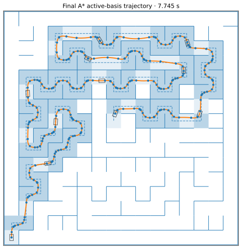

# Continuous geometry optimization

This document describes the outer nonlinear optimization problem that turns a fixed maze topology into a smooth, continuously feasible, time-optimized trajectory.

The speed solver is documented separately in [`SPEED_PROFILE_SOLVER.md`](SPEED_PROFILE_SOLVER.md). The distinction matters: the speed solver answers the minimum-time question **for one exact geometry**, while this layer changes the geometry itself.

<p align="center">
  
</p>

## 1. From a cell topology to a continuous path

A complete discrete route is a sequence of maze cells. That sequence defines a connected corridor, but it is not itself a racing line.

The continuous optimizer replaces the cell-center polyline with a piecewise-linear-curvature path. Each segment has

\[
\kappa(s)=\kappa_0+\sigma s,
\]

and obeys

\[
\frac{dx}{ds}=\cos\theta,\qquad
\frac{dy}{ds}=\sin\theta,\qquad
\frac{d\theta}{ds}=\kappa(s).
\]

These are Euler spirals / clothoids. They provide a natural path basis because curvature varies continuously rather than jumping instantaneously at polyline corners.

The optimizer chooses segment lengths and knot curvatures subject to endpoint, corridor, conditioning, and optional curvature-slope constraints. Traversal time is supplied by the profile-selected hybrid speed solver.

## 2. Exact geometry instead of polygonal optimization variables

The path geometry is propagated directly from the clothoid equations, including numerically careful Fresnel-integral evaluation. Dense XY samples are used for visualization and some diagnostics, but they are not the authoritative path representation.

This distinction prevents an apparently safe coarse polyline from becoming the physical definition of the route. The continuous curve is the object being optimized and certified.

The public knot basis is naturally written as

```text
[s1, k1, s2, k2, ..., sn, kn]
```

where `sj` is a cumulative station and `kj` the curvature at that knot.

## 3. Positive log-length optimizer coordinates

Direct cumulative stations are inconvenient optimizer variables because strict ordering must be maintained:

\[
0<s_1<s_2<\cdots<s_n.
\]

Production therefore uses internal log-length coordinates. If `L_i_ref` is the reference segment length,

\[
L_i=L_{i,\mathrm{ref}}e^{z_i}.
\]

The optimizer sees

```text
[z0, k1, z1, k2, ..., z(n-1), kn]
```

and cumulative stations are reconstructed by summing positive lengths.

This provides several useful properties:

- segment positivity is structural;
- knot ordering cannot be violated by an ordinary finite optimizer step;
- near-collapsed segments can be controlled through explicit numerical/conditioning floors rather than accidental station equality;
- the physical curvature-slope quantity `sigma = Δk / L` remains a separate constraint instead of being hidden inside an arbitrary station box.

The coordinate mapping is implemented in `optimization.knot_parameterization`.

## 4. The robot is a rectangle, not a point

A centerline lying inside the cell union is not sufficient. The optimizer/certifier uses a `RectangleBody` footprint with configurable longitudinal and lateral dimensions.

For each path state, body support must remain inside the convex corridor representation associated with the selected topology. This is why the continuous geometry problem contains substantially more structure than ordinary path smoothing.

The Red Comet case study uses the calibrated physical body dimensions stored in its selected physics profile; the legacy benchmark corpus uses the historical project dimensions.

## 5. Corridor representations

The route can be converted into several corridor bases, including:

- `per_cell`;
- `maximal_runs`;
- `overlapping_cover`.

The production active-basis architecture uses these representations for different purposes rather than treating one basis as universally best.

The reduced problem begins from a **maximal-run basis** that merges compatible corridor structure and lowers the optimization dimension. A richer overlapping representation is retained so additional local turn structure can be activated later when supported by the current solution.

This reduced/full pair is the foundation of selective basis activation.

## 6. Finite NLP constraints vs continuous physical authority

A central design rule is:

> **The finite constraint set exists to make the nonlinear optimizer tractable; it is not the final proof of corridor feasibility.**

A nonlinear solver can only work with a finite set of rows. The project therefore maintains a `ConstraintPool` containing currently active endpoint/corridor/auxiliary rows and can add violated rows through constraint generation/exchange.

But final acceptance uses an independent continuous geometry certificate. It checks the exact path/body against the route corridor rather than assuming the finite samples/cuts were sufficient.

This separation is critical because a path can satisfy every current NLP row while violating a wall between those rows.

## 7. Constraint generation / exchange

The optimizer starts from a manageable finite problem. After solving it, the continuous oracle searches for missing violations. New cuts are inserted and the finite problem is solved again.

The process continues for a bounded number of exchange rounds or until the active constraint pool adequately represents the current candidate.

Constraint exchange is therefore not merely a performance trick. It is the mechanism that lets a finite NLP interact with a continuous physical constraint surface without preallocating an enormous dense row set.

The implementation is primarily in `optimization.constraint_generation` and `optimization.path_optimizer`.

## 8. Exact Jacobians

The geometry layer provides analytic/structured Jacobians for endpoint states and corridor constraints. Time derivatives are supplied by the hybrid speed solver.

These derivatives are important because a single continuous route optimization can require many expensive objective and constraint evaluations. Finite-differencing the entire trajectory problem would multiply that cost and add noise precisely where event-driven speed dynamics already require careful topology handling.

The benchmark campaign independently checks the time-gradient implementation; geometry constraints are additionally exercised by the production regression/certification suite.

## 9. Initialization is part of the algorithm

Direct time minimization from a poor geometry is unreliable. The final route policy therefore treats initialization and staging as first-class algorithmic choices.

The modern pipeline can use:

- a deterministic analytic geometry initializer;
- strict Phase-I feasibility as a fallback when the analytic candidate is not sufficiently feasible;
- length/geometry preparation;
- curvature-oriented preparation;
- final time optimization;
- bounded checkpoint/recovery semantics so a failed expensive worker cannot erase the best certified candidate already found.

Benchmark 4 exists specifically because these choices change both certification reliability and which local basin is reached.

In the checked two-route warm-start experiment, the production and length-then-time schedules certified both routes; direct-time and curvature-then-time variants certified neither under the common budget. The benchmark is deliberately small and should not be read as a theorem that one warm-start ordering always wins.

## 10. Solver backends are not the same as the route architecture

Several names appear in the codebase, and they refer to different levels.

### Low-level finite NLP solver

`optimization.path_optimizer` historically and by default uses scaled SciPy **SLSQP** for a generated finite constraint problem. It has low framework overhead and remains an important fallback/reference backend.

### Qualified primary filter-SQP policy

The integrated route policy can select a custom sparse/filter-SQP backend only inside an empirically qualified small-problem envelope. Outside that envelope, or on failure, it falls back to the certified SLSQP path.

The current `PrimaryTimeBackendMode.AUTO_QUALIFIED_FILTER_SQP` qualification envelope is intentionally narrow; broadening it requires a new route-corpus qualification rather than changing a flag casually.

### Sparse specialist

The repository also retains supervised sparse-specialist machinery that can shadow or polish a certified SLSQP route under explicit policy. Parent-owned certified candidates remain the fallback authority.

### Active basis

`active_basis_v11` is **not merely another NLP backend**. It is the higher-level geometry representation/continuation architecture that decides which problem is solved, when basis structure is activated, how conditioning floors are relaxed, and what constitutes structural closure.

This separation is the result of a long optimizer research campaign: changing the problem supplied to the solver proved at least as important as changing the solver itself.

## 11. Curvature continuation on the reduced basis

The qualified active-basis state machine first works on the reduced maximal-run problem.

It performs curvature-oriented transactions under the frozen guard sequence

\[
q=0.01\rightarrow0.005\rightarrow0.0025.
\]

The exact transaction/trust schedules are encoded in `tools.geometry_homotopy.state_machine.HomotopyPolicy` and are intentionally treated as qualified policy rather than loosely tuned command-line defaults.

The purpose of this stage is to establish a stable geometric basin before the expensive, hybrid time objective dominates the local optimization trajectory.

## 12. Reduced-basis time transactions

After curvature preparation, the reduced trajectory is optimized directly for traversal time.

Transactions are bounded and certification-gated. The state machine records accepted/rejected progress, trust/batch schedule exhaustion, and retained incumbents rather than relying on one opaque solver termination code.

Reduced convergence means the qualified reduced transaction policy has been exhausted under its semantics. It does **not** imply global optimality.

## 13. Selective turn-pair activation

A dense full corridor basis can contain many degrees of freedom that the current trajectory cannot use meaningfully. Exposing all of them at once led to conditioning and local-basin problems during research.

The final architecture instead analyzes **exact turn-cell support** after the reduced solve.

A richer child pair is activated only when both children of a coherent turn can be initialized above the current conditioning threshold with a configured safety fraction. Activation is turn-pair based rather than arbitrary individual-variable growth.

The reduced solution remains a certified incumbent throughout this process.

This yields the project’s central geometry-side idea:

> **Spend trajectory degrees of freedom where the current solution demonstrates that they can matter.**

## 14. Conditioning-floor continuation

Newly activated children begin behind an absolute length floor. The current schedule is

\[
7.5\times10^{-4}
\rightarrow7.0\times10^{-4}
\rightarrow6.5\times10^{-4}
\rightarrow6.0\times10^{-4}.
\]

Each floor is a continuation stage. The branch can reanalyze previously inactive support after geometry changes and may activate additional turn pairs in later rounds.

The purpose is not to impose a physical minimum segment length. It is to prevent the newly expanded NLP from immediately entering a nearly singular representation before the richer geometry has had a chance to establish a useful basin.

## 15. Convergence and closure semantics

`active_basis_v11` calls a route converged only when:

- the reduced-basis state machine establishes its transaction/trust exhaustion semantics; **and**
- the selective-basis branch establishes its own transaction exhaustion / structural closure.

A worker timeout, failed branch, or fallback to a reduced certified incumbent is represented as incomplete/nonconverged unless those closure conditions were actually established.

This matters for long case studies. A numerically excellent incumbent is not relabeled “converged” simply because the richer branch became inconvenient to continue.

The final Red Comet A* release result has `status=complete` and `converged=true` under these current closure rules.

## 16. Checkpointing and failure containment

Long nonlinear solves can enter native code or external numerical libraries that do not always cooperate with Python-level deadlines.

The production architecture therefore uses process boundaries and durable records for expensive route/basis work. Important properties include:

- atomic incumbent/checkpoint writes;
- append-only event logs;
- killable outer workers;
- deterministic recovery of the latest certified candidate;
- richer-basis fallback that never weakens the parent incumbent;
- single-thread environment enforcement for qualified campaigns.

These are not intended as distributed-computing features. They exist to make long numerical optimization recoverable and auditable.

## 17. Historical optimizer experiments

The final architecture emerged only after several alternatives were investigated.

### Dense SLSQP

SLSQP became the original workhorse because its Python/framework overhead is very low. The drawback is that line search can request several expensive scalar speed-profile evaluations for one accepted major step.

### `trust-constr`

SciPy trust-region constrained optimization was tested because it can reduce repeated objective calls on some problems. In practice its higher framework cost and reliability behavior on signed/multi-event cases prevented it from becoming a universal replacement.

### Sparse/filter SQP

A custom filter-SQP / sparse-QP line of work was built around HiGHS subproblems, explicit restoration, persistent active sets, deterministic checkpointing, and failure containment. It demonstrated large callback-count reductions on representative small cases and eventually produced the narrow qualified primary-backend policy retained today.

It was not promoted as an unconditional replacement because broad cases exposed restoration, rank/active-set, portability, and qualification issues.

### Exact/oracle Hessian research

Second-order experiments asked whether BFGS history was the dominant source of slow convergence or basin sensitivity. The measured ceiling was not strong enough to justify implementing a full analytic Hessian/HVP stack: active-set changes, constraint generation, and representation degeneracy remained major costs.

### Full dense basis

The most important negative result was architectural rather than backend-specific. Solving the largest corridor basis from the beginning produced difficult conditioning and unnecessary variables. That result directly motivated reduced-basis optimization and selective activation.

The chronological details are in [`PROJECT_HISTORY.md`](PROJECT_HISTORY.md).

## 18. Local optimality and the OCP result

Even after exact prolongation and reoptimization to 99 clothoid segments, an independent simultaneous CasADi/IPOPT formulation found a lower-time geometry on one benchmark topology.

Production hybrid replay on that OCP-discovered geometry confirms the difference rather than eliminating it as a speed-discretization artifact.

This is important evidence about the **outer geometry optimizer**: the final structured formulation is not globally optimal, and different parameterizations/globalization paths can land in different local basins.

See [`OCP_COMPARISON.md`](OCP_COMPARISON.md) for the controlled experiment.

## 19. Main implementation entry points

| Concern | Primary modules |
|---|---|
| route/corridor construction | `planning.maze_routes`, `tools.geometry_homotopy.goal_entry` |
| clothoid propagation | `optimization.geometry` |
| geometry Jacobians | `optimization.geometry_gradients` |
| optimizer coordinate map | `optimization.knot_parameterization` |
| constraint generation | `optimization.constraint_generation` |
| finite SLSQP/filter-SQP plumbing | `optimization.path_optimizer`, `optimization.sparse_sqp` |
| route-level scheduling | `planning.warm_start_schedule`, `planning.route_optimization_policy` |
| active-basis production API | `planning.active_basis_optimizer` |
| selective basis logic | `tools.geometry_homotopy.basis_activation`, `basis_branch` |
| independent certification | `planning.certification` |
| historical-five qualification CLI | `tools.geometry_homotopy.run_historical_five` |

## 20. Claim boundary

The geometry certificate establishes that a returned trajectory satisfies the configured physical/corridor tolerances. It does not establish a global minimum of the nonlinear trajectory problem.

The most precise release language is therefore:

> **best certified solution found under the qualified continuation/active-basis policy**

rather than “the globally time-optimal continuous trajectory.”

That distinction is deliberate and is reinforced by the independent OCP benchmark.

## Related documentation

- [`ARCHITECTURE.md`](ARCHITECTURE.md) — full planner pipeline
- [`SPEED_PROFILE_SOLVER.md`](SPEED_PROFILE_SOLVER.md) — fixed-geometry time/gradient machinery
- [`PROJECT_HISTORY.md`](PROJECT_HISTORY.md) — optimizer and numerical-method evolution
- [`OCP_COMPARISON.md`](OCP_COMPARISON.md) — independent simultaneous formulation
- [`RED_COMET_CASE_STUDY.md`](RED_COMET_CASE_STUDY.md) — final historical case study
