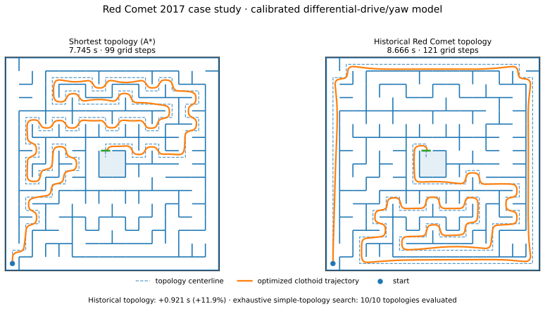
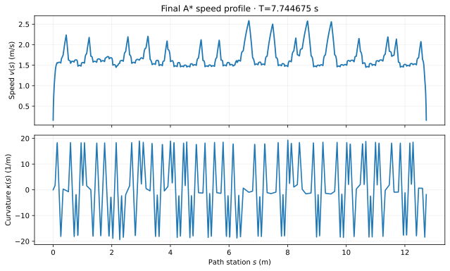

# Red Comet 2017 case study

The Red Comet maze is the historical experiment that closes the loop on the question that originally motivated this project:

> **Can a physically time-optimal planner independently prefer a longer maze topology because its geometry supports higher speed?**

Under the frozen `red_comet_2017_dd_yaw_v1` model, the answer for this particular maze is **no**. The shortest-distance/A* topology remains decisively faster after every candidate route is passed through the same continuous optimizer and certification pipeline.

<p align="center">
  
</p>

The result is intentionally framed as a **model result**, not a claim that the historical team chose a poor racing line. The calibrated model omits important race-day details such as controller behavior, wall sensing, suction dynamics, tire/load effects, battery state, and robustness margins.

## 1. Why Red Comet matters to this project

The project began after seeing the counterintuitive Micromouse idea that the visually shortest route need not be the fastest route. A longer path may contain fewer severe direction changes and longer acceleration zones.

That observation was the reason to move beyond ordinary shortest-path search and ask for a planner that optimizes physical traversal time directly.

The Red Comet case study therefore is not an arbitrary final demo. It asks whether the complete machinery — continuous geometry, vehicle dynamics, topology search, and certification — recovers the type of behavior that inspired the machinery in the first place.

The answer turned out to be more interesting than a successful reproduction: the final model strongly prefers the short route.

## 2. Experimental question

The comparison is deliberately narrow:

> Given the transcribed 2017 reference maze, the corrected historical route, the shortest-distance/A* route, and the frozen Red-Comet-specific DD/yaw model, which topology has the lowest **best certified traversal time found** after the same route optimizer is applied?

The experiment does not fit model parameters to make the historical route win.

It also does not claim a global optimum of the continuous clothoid NLP. The discrete search is exhaustive over its declared simple-topology policy; the continuous solve on each topology remains a local nonlinear optimization.

## 3. Maze transcription

The historical maze is stored as

```text
examples/mazes/historical/red_comet_reference_maze.json
```

using the repository's `ame-maze-v1` format.

The format records exact binary wall topology, coordinate origin, physical scale, semantic goal region, and start information. The loader derives the single planning goal from the unique entrance into the multi-cell goal region.

Historical maze transcription was audited independently at the wall level; see [`examples/mazes/historical/TRANSCRIPTION_AUDIT.md`](../examples/mazes/historical/TRANSCRIPTION_AUDIT.md).

The exact source JSON is hashed by the loader so a result can be tied to the wall data that produced it.

## 4. Historical route transcription

The historical racing line is also represented as an explicit cell topology rather than inferred from the optimizer.

During the final visual overlay audit, a small upper-left prefix error was discovered in the earlier manual transcription. The route that actually matches the reference overlay remains along the left wall for one additional cell before entering the top row.

The canonical corrected route is therefore:

- **122 cells**;
- **121 grid steps**;
- topological length **21.78 m** at 180 mm cell pitch;
- source-path SHA-256 stored in `analysis/red_comet_2017/final_result.json`.

A nearby 121-step alternative remains a genuine member of the exhaustive topology set, but it is no longer labeled as the historical route.

## 5. Why the legacy benchmark physics was not used

The historically qualified `legacy_grid_v1` constants were created for the project's synthetic/benchmark planner, not as a reconstruction of Red Comet hardware.

Using those constants for the capstone experiment would answer only whether the *legacy benchmark robot* prefers the historical topology.

The Red Comet campaign therefore uses a separately named and profile-gated physical model. This avoids silently perturbing the legacy numerical qualification while allowing a more plausible historical case study.

## 6. Calibration philosophy

The Red Comet profile is an evidence-grounded model mapping, not an instrumented system identification.

The scalar calibration encoded in `segment/physics_profiles.py` uses:

- cell pitch: **0.18 m**;
- body: **76 mm × 45 mm**;
- mass: **30.2 g**;
- published straight-speed evidence: **5.0 m/s**;
- published turn-speed range: **1.6–2.1 m/s**;
- nominal turn reference: midpoint **1.85 m/s**;
- reference one-cell 90° primitive peak curvature: `3.7401916933 / cell`;
- same-vehicle nearby-year longitudinal acceleration proxy: **15.5 m/s²**.

Mapping the 1.85 m/s turn reference through `a_lat = v² κ` gives an effective nominal grip acceleration of approximately **71.12 m/s²**. That large value is plausible only as an *effective* suction-mouse grip bound; the model does not separately identify fan pressure, tire friction coefficient, load transfer, or wheel slip.

The historical race outcome is not used as a fitting objective.

## 7. DD/yaw v1 extension

The final case study uses `red_comet_2017_dd_yaw_v1`, which keeps the scalar longitudinal state

\[
w=v^2
\]

but augments the admissible acceleration interval with aggregate left/right drivetrain and yaw effects.

Frozen model identity includes, among other quantities:

| Parameter | Frozen value |
|---|---:|
| effective track | 0.039 m |
| wheel radius | 0.00675 m |
| gear ratio | 4.0 |
| motor no-load speed | 46,000 rpm |
| motor stall torque | 0.000784532 N·m |
| yaw inertia | `1.9632516667e-05 kg·m²` |
| wheel/drivetrain inertia hook | 0 in v1 |

The side constraints make curvature slope physically relevant through yaw acceleration. With `ω ≈ vκ`, yaw acceleration contains a term proportional to

\[
a\kappa+w\sigma.
\]

The resulting speed solver has candidate limits associated with MOTOR, BRAKE, GRIP, SIDE_LEFT, and SIDE_RIGHT, plus internal actuator maximum-velocity-curve anchors.

The model implementation and its source-file hashes are embedded in the final physics-model identity, so cached/certified results cannot be reused across a silent model-code change.

## 8. Boundary convention

The canonical comparison retains the project's configured endpoint convention

```text
init_w = 0.8
terminal_w_max = 0.8
```

in grid-normalized squared-speed units.

At 180 mm cell pitch this corresponds to approximately **0.161 m/s** at both boundaries.

This is a controlled modeling convention, not a claim about the exact historical timing-gate velocity. It is held fixed across the competing topologies so the route comparison is internally consistent.

## 9. Fixed-route gate before blind search

Before spending hours on blind branch-and-bound, the workflow first compared two known fixed topologies:

1. shortest-distance/A*;
2. corrected historical Red Comet route.

Both were passed through the same geometry optimizer, body/corridor model, boundary convention, and selected DD/yaw physics.

This gate served two purposes:

- determine whether the model even entered the historically interesting “longer can be faster” regime;
- catch model/build errors before multiplying them across every topology.

The historical route did not beat A* under the final corrected model, but the blind search was still completed as a controlled exhaustive case study.

## 10. Calibrated-native timing bug and fix

The calibration campaign exposed an important native-build correctness bug.

The isolated native Segment/Crossing/Reverse stack correctly substituted the Red Comet `MU_G` into the GRIP state equation, but one derived inverse-square-root constant used by the GRIP travel-time integral was still hard-coded from the legacy profile.

The result was unusually instructive:

- native GRIP **state** matched Python;
- native GRIP **time** was wrong by a deterministic scale factor;
- complete-route discrepancies were concentrated in envelope intervals owned by GRIP.

The fix made the derived scale depend directly on the active `MU_G` and added a deterministic post-build Python/native differential test that checks both GRIP state and time for each calibrated build.

No active-basis, topology-search, or continuation policy was changed by this fix.

This episode is one reason the final repository treats model identity, state authority, and independent replay as explicit certification concerns.

## 11. Search scope

The compressed Red Comet junction graph admits exactly **10 simple start-to-goal topologies** under the canonical

```text
maximum_node_visits = 1
```

policy.

The final branch-and-bound search exhausted that finite set.

Search summary:

| Quantity | Value |
|---|---:|
| simple complete topologies | **10** |
| expanded nodes | 364 |
| generated nodes | 363 |
| reachability-pruned | 19 |
| bound-pruned | **0** |
| visit-limit rejections | 355 |
| alternative complete topologies optimized after A* seed | 9 |
| search exhausted | **true** |

This is a useful negative result for the lower bound: it was correct/conservative but not strong enough to prune any complete Red Comet candidate.

The multi-hour campaign was therefore dominated by continuous leaf optimization, not graph-search overhead.

## 12. Final topology ranking

| Rank | Route | Cells | Grid steps | Optimized time |
|---:|---|---:|---:|---:|
| 1 | **A* shortest topology** | 100 | **99** | **7.744675 s** |
| 2 | nearest alternative | 104 | 103 | 8.176914 s |
| 3 | **historical Red Comet route** | 122 | 121 | **8.666065 s** |
| 4–10 | remaining alternatives | 122–128 | 121–127 | 8.936572–9.485703 s |

The historical topology is therefore

```text
0.921389609 s
```

or **11.897%** slower than the final A* result under the frozen model.

Topological length also differs substantially:

```text
A*:          17.82 m
historical:  21.78 m
```

<p align="center">
  
</p>

The exhaustive topology summary is rendered in:

```text
assets/red_comet/red_comet_topology_summary.svg
```

## 13. Continuous A* basin recovery and closure

The blind search initially produced a valid A* solution, but a later continuation/recovery investigation exposed a lower certified A* basin.

That candidate became the canonical incumbent and was then run through the current active-basis closure semantics.

The final A* trajectory has:

- **277 hybrid active-basis segments**;
- `status = complete`;
- `converged = true`;
- no newly supported inactive turn pair after final closure;
- current conditioning-floor transaction policy exhausted.

This is best described as the **best certified closed solution found under the qualified active-basis policy**, not a mathematical proof of the global continuous optimum.

## 14. Geometry certificate

The final A* geometry independently reports:

```text
corridor upper bound = 1.9610321189134083e-07
endpoint error        = 1.4356425293016173e-07
certified             = true
```

The certificate checks the continuous rectangular body/corridor problem rather than trusting the finite NLP constraint pool alone.

## 15. Independent dynamic replay

The final geometry is independently evaluated by both Python and native DD/yaw implementations under the canonical boundary conditions.

```text
Python reference: 7.7446749805802995 s
native:           7.7446749806008865 s
difference:       2.0587e-11 s
tolerance:        2e-8 s
certified:        true
```

The saved certificate also records:

- minimum speed state;
- minimum acceleration-interval margin;
- maximum MVC violation;
- anchor/pass counts;
- exact physics-model identity and source hashes.

The compact authority is

```text
analysis/red_comet_2017/final_result.json
```

## 16. What the speed profile says

The final A* release profile contains many internal DD/yaw maximum-velocity anchors and candidate passes before the lower envelope is selected. The geometry is not simply “accelerate on straights, brake at turns.” Curvature slope and side actuator/yaw limits create internal bottlenecks that can occur away from obvious cell corners.

<p align="center">
  
</p>

The public figure converts the internal grid-normalized quantities to SI units:

- station: meters;
- speed: m/s;
- curvature: 1/m.

These conversions are presentation-only; the solver's numerical authority remains the saved normalized trajectory/model.

## 17. Why the result does not invalidate the historical route

The historical robot and the frozen model are not the same physical system.

The model does not fully reconstruct:

- suction fan pressure as a dynamic quantity;
- tire coefficient/load transfer/slip;
- controller state and tracking error;
- wall sensing / wall-following behavior;
- battery voltage and motor thermal state;
- wheel/drivetrain inertia beyond the frozen v1 assumption;
- robustness margins chosen by the team;
- exact timing-gate start/finish semantics;
- race-day tuning.

A historical strategy can be rational under those omitted effects even if the simplified model prefers another topology.

The appropriate conclusion is therefore:

> **Under `red_comet_2017_dd_yaw_v1`, the corrected historical topology is not competitive with the shortest topology after equal continuous optimization.**

not:

> “Red Comet should have taken A*.”

## 18. What the experiment does answer

The case study still answers several project-level questions cleanly.

### Can the software compare long and short routes fairly?

Yes. Both routes use the same corridor/geometry optimizer, endpoint convention, physics profile, and independent certification path.

### Is shortest distance always fastest in this planner?

No. The separate topology benchmark contains two cases where B&B selects a non-A* topology, with up to 27.09% certified improvement.

### Does the Red Comet maze itself exhibit that behavior under this model?

No. A* wins by a large margin and the finite simple-topology search is exhausted.

### Was the expected motivating result forced into the model?

No. The campaign explicitly allowed the experiment to reject the motivating intuition.

That negative result is one of the reasons the project is more useful as a research/engineering exercise than as a demonstration designed around one predetermined outcome.

## 19. Relationship to the independent OCP result

The Red Comet topology conclusion has a large margin over the alternatives, but the outer continuous optimizer is still local.

Benchmark 8 independently demonstrates that a simultaneous OCP can find a lower geometry basin on another fixed topology even after the structured trajectory is refined to 99 segments.

That result is why the Red Comet wording distinguishes:

- exhaustive **discrete** search over the declared finite topology set;
- best certified **continuous** solution found on each topology.

See [`OCP_COMPARISON.md`](OCP_COMPARISON.md).

## 20. Reproducing the public figures

No expensive search or trajectory optimization is needed.

```bash
python -m tools.visuals.red_comet_release
```

This consumes `analysis/red_comet_2017/final_result.json` and regenerates the run-derived release assets under `assets/red_comet/`, including:

- A* vs historical static comparison;
- exhaustive topology summary;
- final A* geometry detail;
- A* speed/curvature profile;
- A* hero GIF;
- synchronized A*/historical GIF.
- machine-readable visual manifest (`visual_summary.json`).

The architecture diagram is maintained separately from

```text
tools/visuals/planner_architecture_tikz.tex
```

and is not regenerated from the case-study snapshot.

## 21. Running the case-study utilities

Cheap topology/lower-bound preflight:

```bash
python -m tools.red_comet.preflight \
  --maze examples/mazes/historical/red_comet_reference_maze.json \
  --output-dir analysis/red_comet_preflight
```

This performs no continuous route optimization.

The more specialized campaign/fixed-route workers under `tools/red_comet/` are retained primarily for reproducibility and research orchestration. Their concise operator reference is [`tools/red_comet/README.md`](../tools/red_comet/README.md).

## Related documentation

- [`PROJECT_HISTORY.md`](PROJECT_HISTORY.md) — why Red Comet motivated the project
- [`ARCHITECTURE.md`](ARCHITECTURE.md) — end-to-end planner architecture
- [`SPEED_PROFILE_SOLVER.md`](SPEED_PROFILE_SOLVER.md) — DD/yaw and legacy hybrid solvers
- [`GEOMETRY_OPTIMIZATION.md`](GEOMETRY_OPTIMIZATION.md) — active-basis continuous optimizer
- [`../examples/mazes/FORMAT.md`](../examples/mazes/FORMAT.md) — custom maze format
- [`../visualization/README.md`](../visualization/README.md) — release visual regeneration
